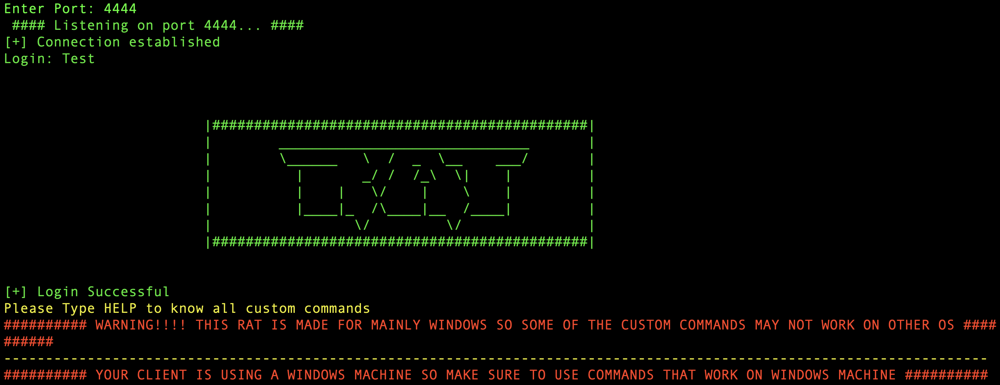

# Python-RAT

A remote access trojan virus project made with Python for ethical hacking cybersecurity class

# Important Notes

- This was made a fun project, not for any malicious purposes

- This only works on other computers that are on the same network

- For all the custom commands, you will be able to execute them no matter what operating system the **attacker** is using. However, there may be some compatibility issues depending on which OS the **victim** is using (which will be specified)

# Setup
**Please note that when the words ***attack*** and ***victim*** are mentioned, ***attack*** refers to `Listen.py` and ***victim*** refers to `client.py`**

 1. In the `client.py` file, (which is the file you will be distributing to the **victim** computer) set the variable `set_private_ip` to the **attack** computer private ip address
    
    - This can be found by running the `findPrivateIP.py` file
    &nbsp;
    &nbsp;
 2. If you would like the `client.py` file to start up every time the **victim** computer powers on, the uncomment **line 497 (the file that calls the ***start_up()*** function)**
 &nbsp;
 &nbsp;
# How to use
 1. Now the setup for the `client.py` file is done. Just execute `client.py` on the **victim** computer. Also note that if the **victim** computer doesn't find the **attack** computer to connect to impatiently, it will just restart and keep looking
 &nbsp;
 &nbsp;
 2. After you get the `client.py` running on the **victim** computer, run the `Listener.py` file on the **attack** computer. You will be prompted to enter a port to scan. The one the client file is using is **4444** so just enter that.
 3. Once the connection is established, you will get a prompt to **Login** with a password. This is just for security in case someone else was to connect to the **victim** computer that you don't want. The default password is ***Test*** (Case sensitive). Feel free to change it on **line 324** of the `client.py` file
 4. After that, you can enter the **help** command for more information on the commands you can run

# Additional features included
 - This includes a built-in keylogger with custom commands
 
 - `(PLEASE NOTE THAT THE KEYLOGGER WILL ONLY WORK WHEN THE VICTEM IS ON WINDOWS)`

   - To inject the keylogger onto the **victem** computer, just type **keylogger start**. Now the keylogger will run on the **victim** computer as long as the `client.py` file is running (even if you are not connected to their computer)
    &nbsp;
    &nbsp;

   - You also run **keylogger get** to download the collected keystrokes from the **victim** computer. It will get saved as a text file in your current directory as `log.txt`
    &nbsp;
    &nbsp;
   - To stop the keylogger from ever running on the **victem** computer again, just run **keylogger end**
- Type the command **lock** to lock the **victems** work station
- Type **clipboard get** what the **victem** currently has copied on their clipboard
- Type **download** to download a file from the **victem** computer onto yours. Please note that this feature still is a bit buggy. `This feature is also currently only available for when the VICTEM computer is on windows`
- Type **speak (any text of your choice)** and the text-to-speech translator will say the text out loud on the **victim** computer. `This feature is also currently only available for when the VICTEM computer is on windows`
- Type **wifi pass** to get the most likely wifi passwords on the **victim** computer. However, this doesn't really serve too much of a purpose since you will have to be on the same network to connect to their computer `This feature is also currently only available for when the VICTEM computer is on windows`
- Type **shutdown** and **cshutdown** to cancel and start a shutdown of the **victem** computer. `This feature is also currently only available for when the VICTEM computer is on windows`
- Type **pubip** to get the **public IP address** of the **victem** computer
- Type **quit** to stop the connection
- Also, right after the connection is established and you log in, it will show you the public ip, os, and the username of the **victim** computer
